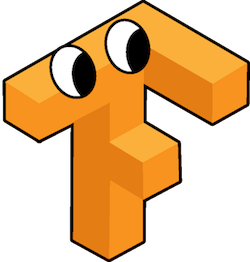

# Esoteric Tensorflow

TensorFlow's graph is Turing complete.

## Requirements

* TensorFlow 1.2.0+

## Algorithms implemented in TensorFlow

### Basic

- [x] Fizz Buzz
- [x] Euclidean Algorithm
- [x] 99 Bottles of Beer
- [x] ASCII to Charactor

### Data Structure

- [x] Stack
- [ ] Queue
- [ ] Tree

### Sort Algorithms

- [x] Bubble Sort
- [x] Insertion Sort
- [x] Quick Sort
- [ ] Merge Sort

### Search Algorithms

- [x] Linear Search
- [x] Binary Search

### Esolangs

- [x] HQ9+
- [x] Brainfuck
- [ ] Whitespace

## License

[MIT](https://github.com/akimach/EsotericTensorFlow/blob/master/LICENSE)

